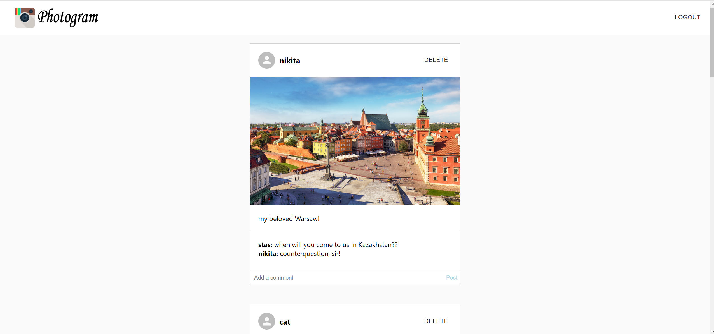
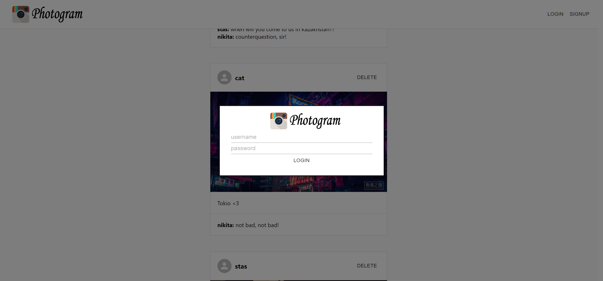

## Photogram - social network clone project
### Запуск FastAPI:

Перейти в папку Python_FastAPI и создать виртуальное окружение командой 
**python3 -m venv env** и активировать его командой:

**env\Scripts\activate.bat** - для Windows

**source env/bin/activate** - для Linux и MacOS.

Затем необходимо установить зависимости командой:
**pip install -r requirements.txt**

Затем необходимо запустить команду **uvicorn main:app --reload** для 
запуска сервера uvicorn.

После этого можно зайти в браузере по адресу **http://localhost:8000/docs** для просмотра доступных эндпоинтов.

### Запуск React JS:
Перейти в папку react_js и запустить сервер командой: **npm start**

Далее автоматически откроется окно сайта по адресу **http://localhost:8000/**

#### Главная страница:

#### Окно входа в аккаунт:

